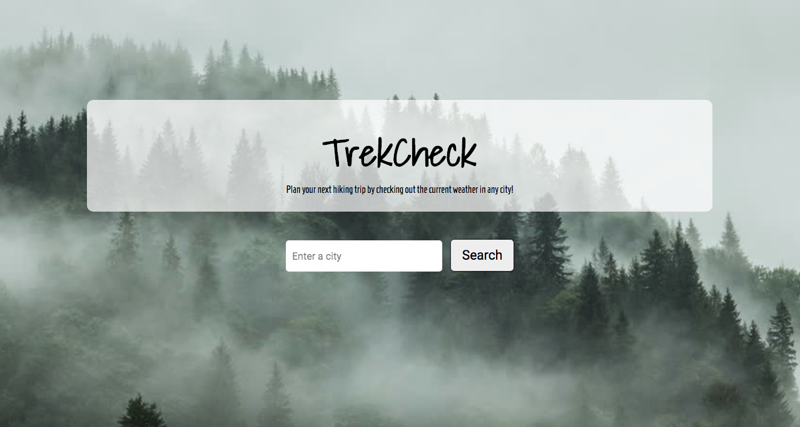
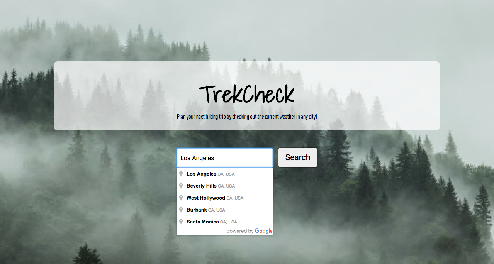
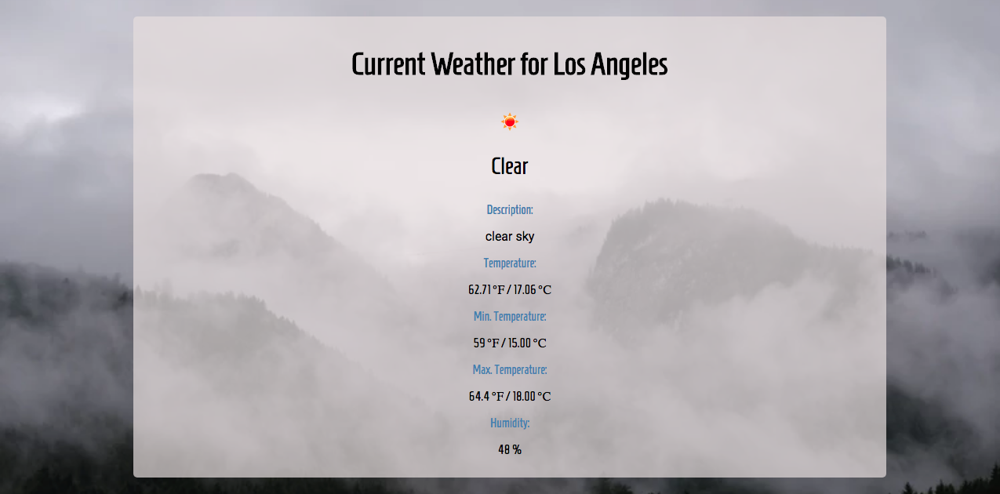
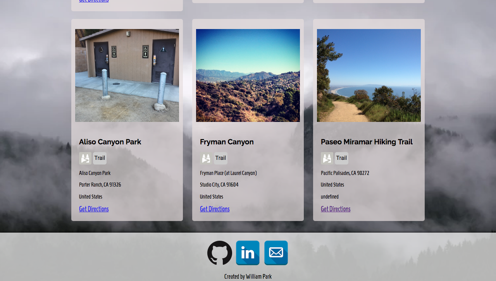

# TrekCheck

A responsive web application that pulls data from multiple third party APIS such as OpenWeatherMap, FourSquare, and GoogleMaps. The app allows users to search hiking and weather data in an efficient and useful way. 

## Screenshots
Start Display Page

Search City Page

Weather Results Page

Hiking Results Page

Bottom Page

## Introduction
TrekCheck is a weather/hiking app that goes above above and beyond a regular hiking app and saves you the hassle of opening up multiple web pages to view search results. TrekCheck allows users to look up both weather and hiking places in a specified city. Plan your next hiking trip by checking out the weather in any city with one quick search!

## Technical
The app was built using HTML5, CSS, JavaScript, and jQuery.
The app is fully responsive.
The app pulls data from multiple third party APIs such as OpenWeatherMap, FourSquare, and GoogleMaps.

