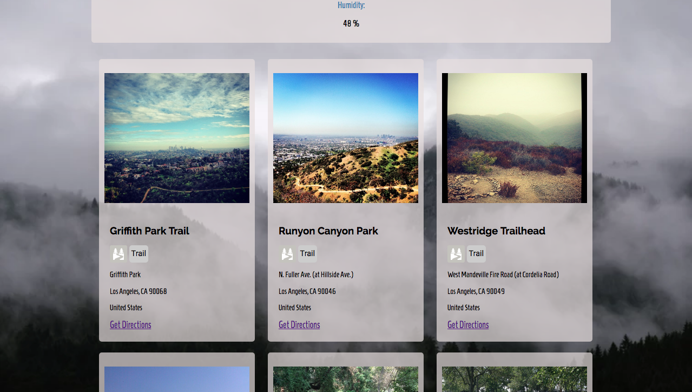

# TrekCheck

A responsive web application that pulls data from multiple third party API such as OpenWeatherMap, FourSquare, and GoogleMaps. The app allows users to search hiking and weather data in an efficient and useful way. 

## Introduction
TrekCheck is a weather/hiking app that goes above and beyond a regular hiking app and saves you the hassle of opening up multiple web pages to view search results. TrekCheck allows users to look up both weather and hiking places in a specified city. Plan your next hiking trip by checking out the weather in any city with one quick search!

## Live Demo
You can find the live demo of TrekCheck at: 
https://wjypark94.github.io/trek-check/

## Note
The Foursquare API currently has a rate limit of 500 premium API calls per day. As of May 31, 3018 I had to add another Foursquare API endpoint to get Foursquare venues photos (premium calls) so this application will only be able to make 500 calls per day. If the daily quota max is used up, results will not be shown but will be available to use the next day.

## Screenshots
Start Display Page

Search City Page

Weather Results Page

Hiking Results Page

Bottom Page

## Technical
<li> The app was built using HTML5, CSS, JavaScript, and jQuery.  
<li> The app is fully responsive.  
<li> The app pulls data from multiple third party APIs such as OpenWeatherMap, FourSquare, and GoogleMaps.

